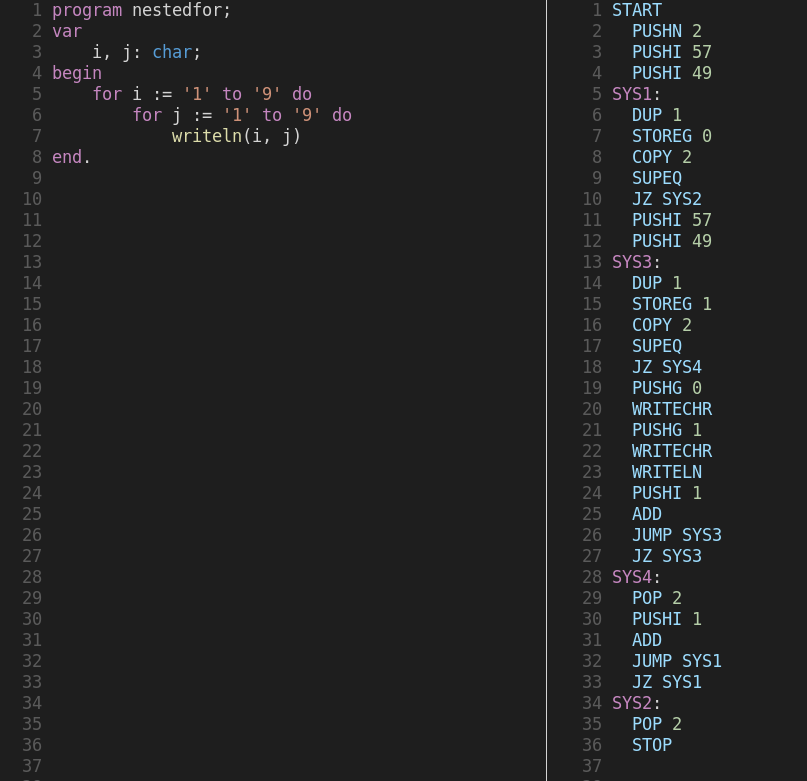

# PL

A Pascal optimizing compiler for the [EWVM](https://github.com/jcramalho/EWVM), made for UMinho's
2024/25 Language Processing class. The compiler supports scalar types and multi-dimensional arrays,
as described by [ISO 7185:1990](https://archive.org/details/iso-iec-7185-1990-Pascal). See
[Assignment.pdf](Assignment.pdf) for more details.

Grade: 20 / 20 :star:



### Authors

 - Humberto Gomes (A104348)
 - José Lopes (A104541)
 - José Matos (A100612)

# Setup

Start by cloning this repository, and creating a Python virtual environment:

```
$ git clone https://github.com/voidbert/PL.git
$ python -m venv .venv
```

To run the project, do:

```
$ source .venv/bin/activate
$ pip install --editable .
$ plpc
```

To exit the virtual environment, you can run:

```
$ deactivate
```

# Developers

All code must be verified with the `pylint` and `mypy` static checkers, which can be installed
(inside the `venv`) with the following command:

```
$ pip install pylint mypy
```

Before opening a Pull Request, please run your code though `pylint` and `mypy`, fixing any error
that may appear:

```
$ pylint plpc tests
$ mypy plpc tests
```

Our configuration for these checkers disallows the use of dynamic typing, and your PR won't be
accepted if these checks are failing.

You can also test the compiler using `pytest`. To install it, run:

```
$ pip install pytest
```

Then, you can run the tests:

```
$ pytest
```
